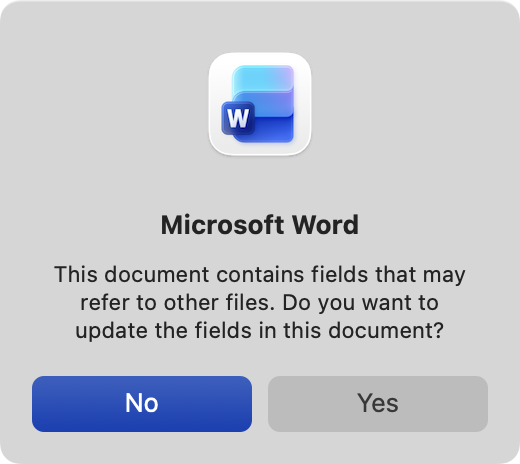
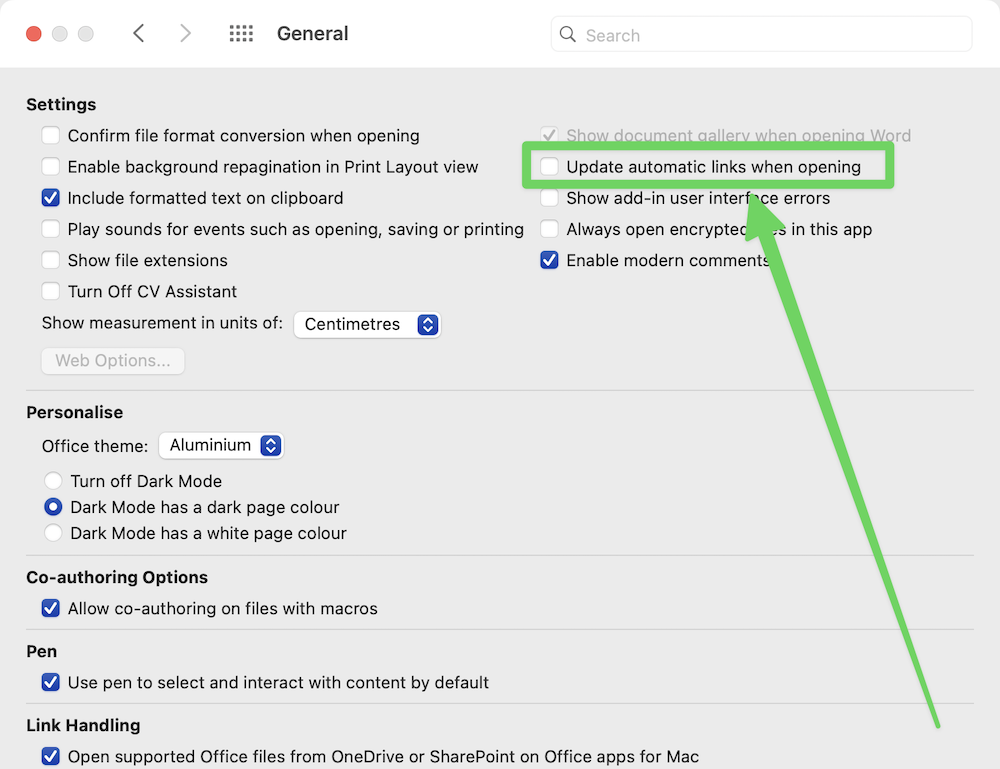

# quarto4sbp

Python tool for working with [quarto](https://quarto.org/) in [Schuberg Philis](https://schubergphilis.com/).

## Prerequisites

- **Python 3.13+** with `uv` package manager: try `brew install uv` on Mac
- [quarto](https://quarto.org/) CLI installed: try `brew install quarto` on Mac
- for PDF export:
  - **Mac OS X**
  - **Microsoft Office**:
    - **Microsoft PowerPoint** - for PDF export of presentations
    - **Microsoft Word** - for PDF export of documents

## Installation

```bash
uv venv
source .venv/bin/activate
uv pip install -e .
python install.py
```

This creates a `~/.local/bin/q4s` shim that runs the CLI from the project's venv.

After installation, you can use `q4s` directly:

```bash
q4s help
```

Ensure `~/.local/bin` is in your PATH. If not, add this to your `~/.bashrc` or `~/.zshrc`:

```bash
export PATH="$HOME/.local/bin:$PATH"
```

## Usage

### q4s CLI Tool

The `q4s` CLI provides utilities for working with Quarto presentations and documents.

**Available Commands:**

```bash
# Show help
q4s help

# Create PowerPoint and Word documents (unified)
q4s new <directory>

# Create PowerPoint presentation
q4s new-pptx <directory>

# Create Word document
q4s new-docx <directory>

# Export all Office documents to PDF
q4s pdf

# Export PowerPoint files to PDF
q4s pdf-pptx

# Export Word documents to PDF
q4s pdf-docx
```

### Rendering Documents

Each created project includes a `render.sh` script that:
1. Renders the Quarto file (`.qmd`) to Office format (`.pptx` or `.docx`)
2. Exports the Office file to PDF

```bash
cd my-presentation
./render.sh
```

You can also run `q4s pdf` in any directory to convert files.

### Disable Word automatic link updates

If you get this dialog from Word on PDF conversion:



You can disable automatic link updates in Word preferences:



Step-by-step instructions:
- Open **Microsoft Word**
- Go to **Word** > **Preferences**
- Select **General**
- Uncheck **Update automatic links at open**

## LLM Setup and Configuration

The `q4s` CLI includes AI-powered features that use Large Language Models (LLMs) for tasks like tone-of-voice rewriting and image generation. These features require LLM API access.

### Prerequisites

You'll need:
- An API key for our [LiteLLM Proxy](https://schubergphilis1.atlassian.net/wiki/spaces/SBPAI/pages/861634709/LLM+Proxy)
- Your VPN connection open

### Quick Setup

The simplest way to get started is with an environment variable:

```bash
# Set your API key
export OPENAI_API_KEY="sk-..."

# Test the connection
q4s llm test
```

### Configuration Options

#### Environment Variables

The following environment variables are supported:

- **`OPENAI_API_KEY`** (required): Your API key for authentication
- **`OPENAI_API_MODEL`** (optional): Override the default model
- **`OPENAI_API_URL`** (optional): Custom API endpoint URL

Example:
```bash
export OPENAI_API_KEY="sk-..."
export OPENAI_API_MODEL="azure/gpt-5-mini"
export OPENAI_API_URL="https://litellm.sbp.ai/v1"
```

#### Configuration Files

For more advanced configuration, you can use TOML files. q4s supports two configuration locations:

1. **User config**: `~/.config/q4s.toml` (applies to all projects)
2. **Project config**: `./q4s.toml` (overrides user settings for this project)

**Example `~/.config/q4s.toml`:**
```toml
[llm]
model = "azure/gpt-5-mini"           # Default model
api_key = "${OPENAI_API_KEY}"        # Environment variable expansion
max_tokens = 10000                   # Maximum tokens per request
temperature = 0.7                    # Sampling temperature (0.0-1.0)
timeout = 30                         # Request timeout in seconds

[llm.retry]
max_attempts = 3                     # Retry attempts on failure
backoff_factor = 2                   # Exponential backoff multiplier
```

**Example project-specific `q4s.toml`:**
```toml
[llm]
model = "gpt-4"                      # Use GPT-4 for this project
temperature = 0.5                    # More deterministic output
max_tokens = 5000                    # Lower token limit
```

#### Configuration Hierarchy

Settings are loaded in the following order (later overrides earlier):

1. Default values (built into q4s)
2. User config (`~/.config/q4s.toml`)
3. Project config (`./q4s.toml`)
4. Environment variables (highest priority)

This allows you to set global defaults in your user config, override them per-project, and use environment variables for temporary changes or CI/CD.

#### Environment Variable Expansion

Configuration files support `${VAR_NAME}` syntax for environment variables:

```toml
[llm]
api_key = "${OPENAI_API_KEY}"        # Expands to env var value
base_url = "${CUSTOM_API_URL}"       # Works for any setting
```

This is useful for keeping secrets out of version control while still using configuration files.

### Testing Your Setup

After configuring your API key, test the connection:

```bash
q4s llm test
```

This command:
- Verifies your configuration is loaded correctly
- Tests API connectivity with a simple prompt
- Displays response time and model information
- Helps diagnose connection issues

If the test succeeds, you'll see:
```
✓ Configuration loaded successfully
  Model: azure/gpt-5-mini
  Max tokens: 10000
  Temperature: 0.7
  Timeout: 30s

✓ LLM client initialized

Testing API connectivity...
✓ API call successful
  Response: Hello from LLM
  Elapsed time: 1.23s

LLM integration is working correctly!
```

### Troubleshooting

**Error: "API key not configured"**
- Set `OPENAI_API_KEY` environment variable, or
- Add `api_key` to your `q4s.toml` file

**Error: "API call failed"**
- Check your API key is valid and has sufficient permissions
- Verify network connectivity to the API endpoint
- Ensure your API key has credits/quota available
- Check if you need to set a custom `base_url`

**Slow responses or timeouts**
- Increase `timeout` in your configuration
- Check your network connection
- Try a different model (some are faster than others)

### Available Models

The default model is `azure/gpt-5-mini`, but you can use any model supported by your LLM provider. Common options:

- `azure/gpt-5` - capable, slower
- `azure/gpt-5-mini` - Default, balanced performance
- `aws/claude-4-5-sonnet` - capable alternative from Anthropic

### Security Best Practices

- **Never commit API keys to version control**
- Use environment variables or expand them in config files: `api_key = "${OPENAI_API_KEY}"`
- Set appropriate file permissions on config files: `chmod 600 ~/.config/q4s.toml`
- Use project-specific API keys when possible
- Rotate keys regularly

## Development

### Spec-Based Development

This project follows a spec-based development approach documented in [`docs/spec`](docs/spec).

### Development Guidelines
- See [CLAUDE.md](CLAUDE.md) for Claude Code-specific guidance
- See [AGENTS.md](AGENTS.md) for development guidelines and agent instructions
- See [DESIGN.md](DESIGN.md) for architectural decisions and design rationale
- Reference spec numbers in commit messages during feature implementation
- Run tests after changes: `uv run pytest`

### Git

Follow [Conventional Commits](https://conventionalcommits.org/) with types:

- build: Changes that affect the build system or external dependencies (example scopes: gulp, broccoli, npm)
- ci: Changes to our CI configuration files and scripts (example scopes: Travis, Circle, BrowserStack, SauceLabs)
- docs: Documentation only changes
- feat: A new feature
- fix: A bug fix
- perf: A code change that improves performance
- refactor: A code change that neither fixes a bug nor adds a feature
- revert: undoing (an)other commit(s)
- style: Changes that do not affect the meaning of the code (white-space, formatting, missing semicolons, etc.)
- test: Adding missing tests or correcting existing tests
- improvement: Improves code in some other way (that is not a feat or fix)
- chore: Changes that take care of some other kind of chore that doesn't impact the main code

### LLM Testing

The project includes a mock-based testing infrastructure for LLM-powered features. This allows testing without making real API calls. See [docs/llm-testing-guide.md](docs/llm-testing-guide.md).

**Running Example Tests:**
```bash
# Example tests are skipped by default
RUN_EXAMPLE_TESTS=1 uv run pytest tests/test_llm_examples.py -v
```

### Testing

Unit and integration tests are located in `tests/`. Run them using:

```bash
# Full test suite
uv run pytest

# Specific test file
uv run pytest tests/my_test_file.py

# With verbose output
uv run pytest -v

# With coverage report
uv run pytest --cov=quarto4sbp --cov-report=term-missing

# Check coverage meets minimum threshold (90%)
uv run pytest --cov=quarto4sbp --cov-report=term --cov-fail-under=90

# With integration tests (not for agents!)
RUN_INTEGRATION_TESTS=1 uv run pytest -v
```

### Test Coverage Requirements

- Minimum test coverage: 80%
- Coverage is enforced in CI - builds will fail if coverage drops below threshold
- Run coverage checks before creating PRs

### Type Checking

This project uses strict type checking with pyright. Run type checks using: `uv run pyright`.

All code must pass pyright checks with no errors or warnings before merging.
